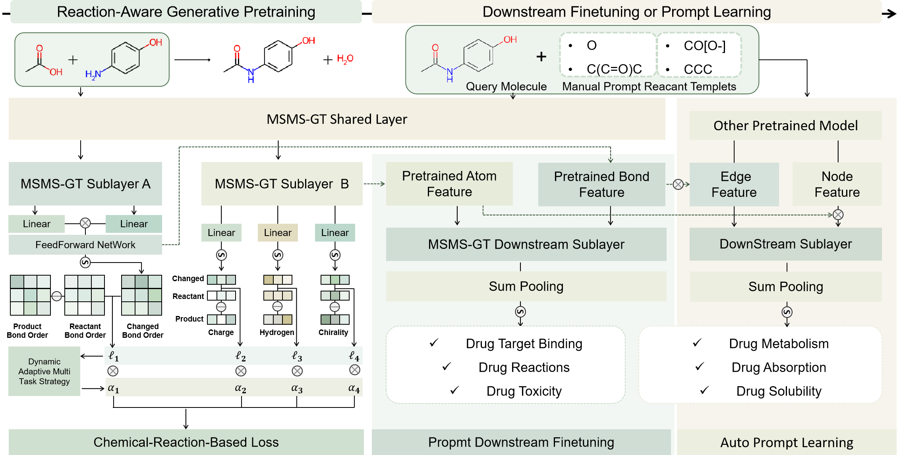

# MolCAP
Molecular Chemical reActivity pretraining and prompted-finetuning enhanced molecular representation learning 
# Overview

\
Molecular representation learning (MRL) is a fundamental task for drug discovery. However, previous deep-learning (DL) methods focus excessively on learning robust inner-molecular representations by mask-dominated pretraining framework, neglecting abundant chemical reactivity molecular relationships that have been demonstrated as the determining factor for various molecular property prediction tasks. Here, we present MolCAP to promote MRL, a graph pretraining Transformer based on chemical reactivity (IMR) knowledge with prompted finetuning. Results show that MolCAP outperforms comparative methods based on traditional molecular pretraining framework, in 13 publicly available molecular datasets across a diversity of biomedical tasks. Prompted by MolCAP, even basic graph neural networks are capable of achieving surprising performance that outperforms previous models, indicating the promising prospect of applying reactivity information for MRL. In addition, manual designed molecular templets are potential to uncover the dataset bias. All in all, we expect our MolCAP to gain more chemical meaningful insights for the entire process of drug discovery.
